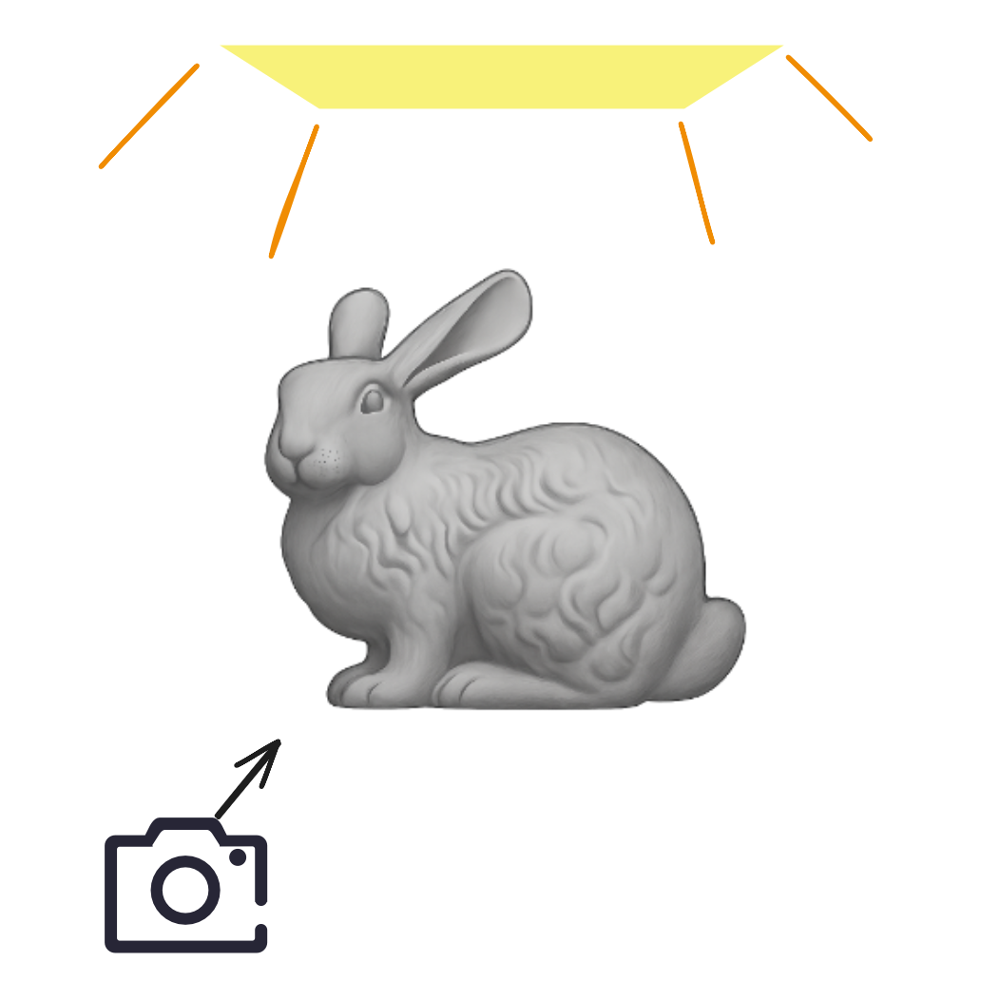

# Paper Reading - Compressive Light Transport Sensing

## What is Compressive Sensing?

Consider the following linear equation:
\begin{equation}
\boldsymbol{y} = \boldsymbol{A}\boldsymbol{x},
\end{equation}
where $$\boldsymbol{x}$$ is an n-dimensional **unknown signal to be solved**, $$\boldsymbol{A}$$ is an $$m \times n$$ matrix known as the **measurement matrix** used to measure the unknown signal $$\boldsymbol{x}$$, and the vector $$\boldsymbol{y}$$ is an m-dimensional column vector representing the **observation result** after measurement. Generally, if we can ensure that $$m>n$$ and the rank of $$\boldsymbol{A}$$ is greater than or equal to $$n$$, the unknown signal $$\boldsymbol{x}$$ can be solved precisely. However, if $$m \ll n$$, the equation is **underdetermined**, and the solution is not unique.

Compressive Sensing (CS) investigates the problem of how to find a solution $$\boldsymbol{x}$$ that satisfies a certain sparsity $$k (k \ll n)$$ for such an underdetermined linear equation.

> K-Sparse: A vector is k-sparse if it has at most k non-zero elements.

## Why "Compressive"?

As mentioned, Compressive Sensing aims to find a sparse solution in an underdetermined linear system. The "compressive" nature is embedded in the sparsity of this solution. Why is that?

Any vector is essentially a discrete representation under a certain set of basis vectors, such as the common basis in three-dimensional space: $$(1, 0, 0), (0, 1, 0), (0, 0, 1)$$. **If our solution is sparse, it means that in a space formed by $$n$$ basis vectors, the signal can be represented using only $$k$$ of them.** The remaining basis vectors can be ignored. We only need to retain these $$k$$ basis vectors to reconstruct the original signal with high fidelity, thus achieving **compression**.

## Applying Compressive Sensing to Light Transport

Consider a scene, for example:

**In this scene, every object, including the camera and the light source, is fixed.** We want to find a Light Transport function such that when our light source changes, we can solve for the scene under the new lighting. This is a constrained Capture-Relighting problem.

In the work of [Peers et al. (2009)](http://doi.acm.org/10.1145/1477926.1477929), the authors demonstrated that this problem can be described by a linear equation:
\begin{equation}
\boldsymbol{C}=\boldsymbol{T}\boldsymbol{L},
\end{equation}
where $$\boldsymbol{C}$$ is a $$p \times m$$ matrix of observation results, with $$p$$ being the number of pixels and $$m$$ the number of captures (observations). $$\boldsymbol{T}$$ is a $$p \times n$$ Light Transport matrix, where $$n$$ is the number of light source parameters. $$\boldsymbol{L}$$ is an $$n \times m$$ matrix describing the light sources.

This direct method of describing the rendering process with a linear equation has the following conventions:

- **No need to model camera parameters, light source size, or the relative positions of objects.** All this information is implicitly contained within the Light Transport Matrix (somewhat like a neural network).
- **The light source needs to be parameterized.** For example, if the light source consists of m point lights, the dimension of the light source parameter vector is $$m$$. If it's a constant area light, the dimension is $$1$$. If it's an area light controlled by a texture map, the dimension is the number of pixels in the texture, $$p'$$. Each value can represent radiance.

In this equation, each row vector of $$\boldsymbol{T}$$ is the Light Transport Function (or Reflectance Function) we need to solve. If we want to solve for this matrix, assuming we have a complex light source of $$128 \times 128$$ (like a textured area light), a single pixel would require solving for 16,384 coefficients. This means we would need to capture 16,384 sets of results and solve them one by one, which is a significant overhead.

Therefore, we want to apply Compressive Sensing to solve for the Light Transport Function—reducing the number of measurements and transforming the Light Transport Function into a compressible basis to find a sparse solution. The paper also notes that **Reflectance Functions** are compressible in certain bases (like wavelets, spherical harmonics, etc.).
> Compressibility: When the coefficients of a vector are sorted in descending order of magnitude, their values drop off sharply. This indicates that we only need the first few significant basis coefficients to reconstruct most of the signal's information.

## Transformation to the Haar Wavelet Space
The Haar wavelet is a very simple set of basis functions, composed only of the values `0, -1, 1`, and the basis vectors are mutually orthogonal. Haar wavelets can also be used for image compression. You can get a preliminary understanding from this blog post: [Haar Wavelet](https://zhuanlan.zhihu.com/p/386322623).